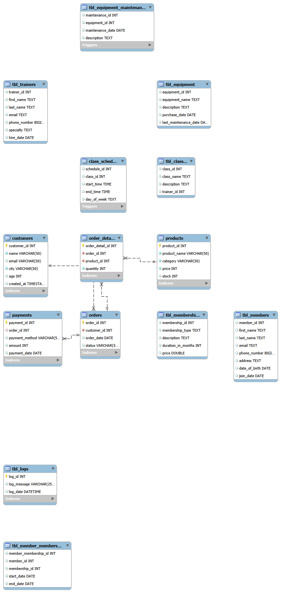
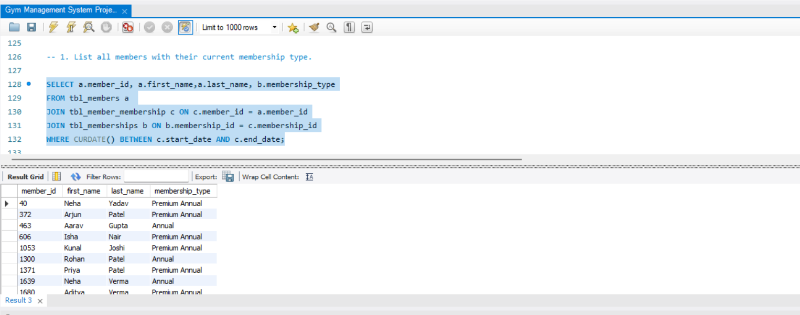
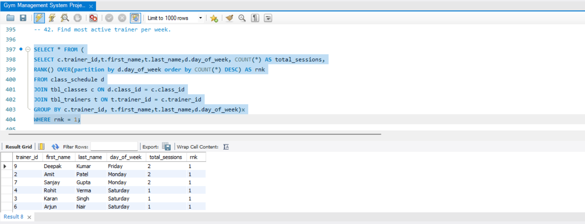
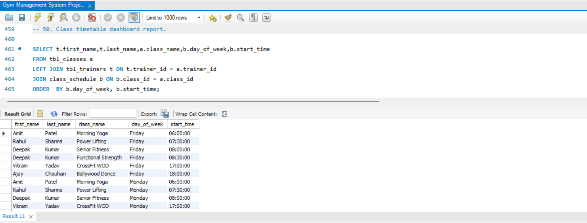
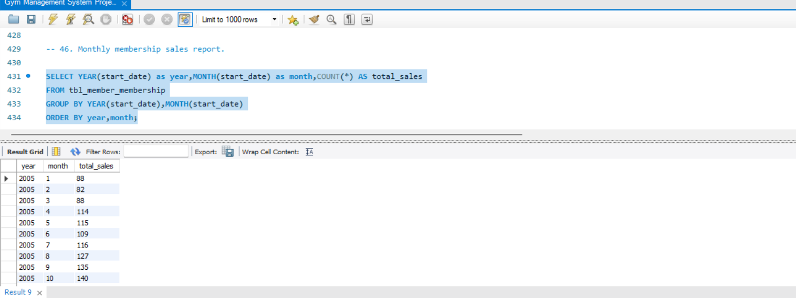
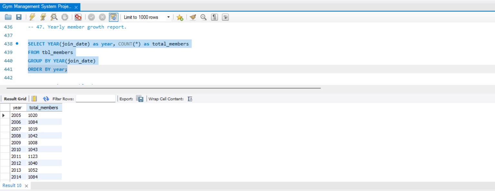

# 🏋️ Gym Management System | MySQL

A comprehensive **Gym Management System** built using **MySQL** to manage members, memberships, trainers, classes, schedules, and business reporting.
This project demonstrates database design, SQL development, automation, and data analysis using real-world scenarios.

---

## 🚀 Project Overview

This system helps manage core gym operations such as:

* Member registration and membership tracking
* Trainer management and workload analysis
* Class scheduling and timetable creation
* Equipment tracking and maintenance
* Automated business reporting using SQL

---

## ✨ Key Features

### 👤 Member Management

* Member registration and details tracking
* Membership type assignment
* Membership analytics

### 🏋️ Trainer Management

* Trainer profiles
* Class assignments
* Weekly workload tracking

### 📅 Class Scheduling

* Timetable management
* Trainer-class mapping
* Schedule optimization

### 💰 Sales & Revenue Tracking

* Monthly membership sales
* Revenue analysis
* Yearly growth trends

### ⚙️ Automation

* Triggers for data consistency
* Automated updates for records
* Business rule enforcement

---

## 🛠️ Tools & Technologies

* MySQL
* SQL

---

## 📊 SQL Concepts Used

* Joins
* Aggregate Functions
* Subqueries
* Group By & Having
* Views
* Stored Procedures
* Triggers
* Window Functions

---

## 📸 Project Screenshots

### 📊 Database Schema

### 👤 All Members & Membership Types

### 🏋️ Most Active Trainer Per Week

### 📅 Timetable Report

### 💰 Monthly Sales Report

### 📈 Yearly Growth Report

---

## 📁 Project Files

* Gym Management System Project 2.sql
* screenshots/ (folder)

---

## 🎯 Learning Outcomes

* Database schema design
* Writing optimized SQL queries
* Building analytical reports
* Implementing triggers and automation
* Structuring real-world database systems
